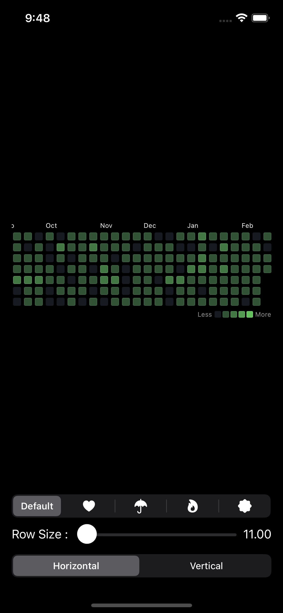
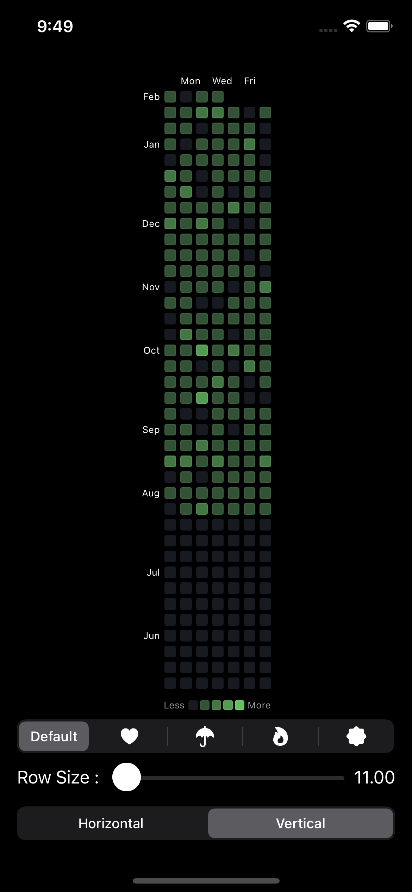
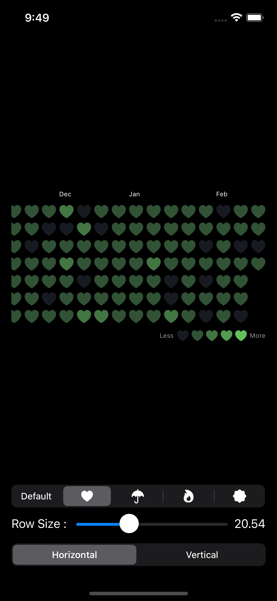
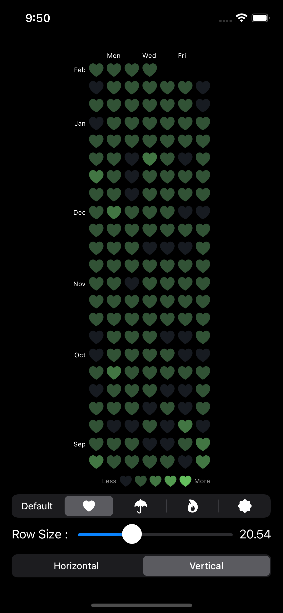

# **AxisContribution for SwiftUI**
A library that expresses a github contribution calendar through an array of dates. Supports iOS and macOS.

[](https://developer.apple.com/macOS)
[](https://developer.apple.com/iOS)
[](https://developer.apple.com/macOS)
[](https://www.instagram.com/dev.fabula)
[](https://developer.apple.com/documentation/swift_packages/package/)
[](https://opensource.org/licenses/MIT)  

## Screenshot
|Horizontal|Vertical|
|:---:|:---:|
|||
|||

https://user-images.githubusercontent.com/1617304/155326706-f3c7400a-797c-44a0-8dcf-3e113b9943cc.mov

## Example
[https://fabulaapp.page.link/231](https://fabulaapp.page.link/231)

## Usages
```swift
/// Initializes `ACConstant`
/// - Parameters:
///   - fromDate: The start date to display the list of contributions. The default value is `1 year from today.`.
///   - toDate: The end date to display the list of contributions. The default value is `today`.
///   - spacing: The spacing in the row view showing the list of contributions. The default value is `4`.
///   - levelSpacing: A number that separates units between contribution levels. The default value is `3`.
///   - axisMode: The axis mode of the component. The default value is `.horizontal`.
///   - font: The font used for text. The default value is `.system(size: 9)`.

AxisContribution(constant: .init(), source: [Date(), Date()])
// or
AxisContribution(constant: .init(), source: [Date(), Date()]) { indexSet, data in
    Image(systemName: "heart.fill")
      .foregroundColor(Color(hex: colorScheme == .dark ? 0x171B21 : 0xF0F0F0))
      .font(.system(size: rowSize))
      .frame(width: rowSize, height: rowSize)
} foreground: { indexSet, data in
    Image(systemName: "heart.fill")
      .foregroundColor(Color(hex: 0x6CD164))
      .font(.system(size: rowSize))
      .frame(width: rowSize, height: rowSize)
}
```
  
## Swift Package Manager
The Swift Package Manager is a tool for automating the distribution of Swift code and is integrated into the swift compiler. Once you have your Swift package set up, adding AxisContribution as a dependency is as easy as adding it to the dependencies value of your Package.swift.

```swift
dependencies: [
    .package(url: "https://github.com/jasudev/AxisContribution.git", .branch("main"))
]
```

## Contact
instagram : [@dev.fabula](https://www.instagram.com/dev.fabula)  
email : [dev.fabula@gmail.com](mailto:dev.fabula@gmail.com)

## License
AxisContribution is available under the MIT license. See the [LICENSE](LICENSE) file for more info.
